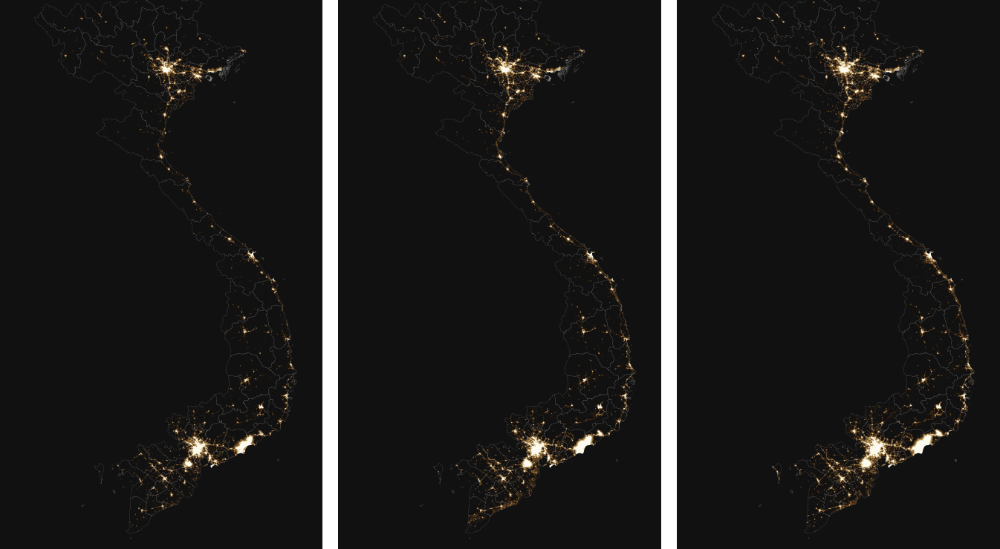
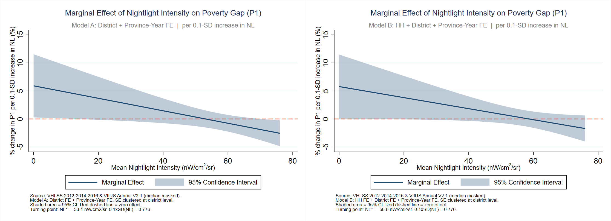

# Impact of Urbanization on Poverty in Vietnam

**Does urbanization reduce poverty in Vietnam, and does the relationship follow an inverted-U?**
This project uses VIIRS satellite nighttime lights as an objective measure of urbanization and links them to Foster–Greer–Thorbecke (FGT) poverty indices from a balanced household panel (VHLSS 2012, 2014, 2016), estimated with district, household, and province-year fixed effects.

*Development Economics final project · International University, Vietnam National University – Ho Chi Minh City · May 2026 · Instructor: Dr. Nguyen Phuoc Thien Anh*

**Authors** (alphabetical): Duong Hanh Trang, Duong Thi Nhu Y, Hoang Quang Huy, Nguyen Dinh Tu

📄 Full paper: [`paper/Urbanization_Poverty_Vietnam_paper.pdf`](paper/Urbanization_Poverty_Vietnam_paper.pdf)


*VIIRS Annual V2.1 nighttime lights over Vietnam (2012, 2014, 2016), the urbanization proxy used in the analysis.*

---

## Key findings

| Level | Result |
|---|---|
| **District** (678 districts, 2,034 obs.) | Nightlight and its square are **not significant** for any FGT measure (P0, P1, P2), so neither H1 nor H2 is supported at this level. |
| **Household** (1,864 households, 5,592 obs.) | **Poverty gap (P1) shows an inverted-U** in nightlight, significant at the 5% level. The turning point is ≈ 53 nW/cm²/sr (district + province-year FE) and ≈ 59 nW/cm²/sr (adding household FE), inside the observed range (max 76.8). Poverty incidence (P0) and severity (P2) show no significant pattern at 5%. |
| **Education** | The most consistent predictor of lower poverty. One more year of schooling is associated with **1.7–2.3 pp lower poverty incidence** (households, p < 0.001) and 5.4 pp lower district poverty incidence. |
| **Policy takeaway** | Urbanization alone does not reduce poverty on every dimension; education investment and support for ethnic-minority households matter alongside it. |


*Marginal effect of a 0.1-SD increase in nightlight on P1 (% change), by initial nightlight level. Left: district + province-year FE. Right: household + district + province-year FE. The effect is positive at low nightlight, crosses zero at the turning point, and turns negative at higher levels.*

---

## Research question and hypotheses

Structural-transformation theory (Lewis, 1954) suggests rural-to-urban migration raises incomes, while Harris–Todaro (1970) shows migrants can face informal work and high living costs before reaching formal jobs. Both effects can coexist, motivating two hypotheses:

- **H1:** Conditional on district, household, and province-year fixed effects, nightlight intensity is significantly associated with poverty.
- **H2:** The relationship is non-linear (inverted-U): poverty first rises with urbanization, then falls after a threshold.

## Data

| Source | Description | Use |
|---|---|---|
| **VHLSS 2012, 2014, 2016** (General Statistics Office of Vietnam) | Nationally representative household living-standards survey | Household expenditure, demographics, education, ethnicity |
| **VIIRS Annual V2.1** (median, masked) | Satellite nighttime light, nW/cm²/sr | Mean nightlight per district via zonal statistics, assigned to every household in the district |

Poverty is measured from per-capita real expenditure (adjusted with a spatial cost-of-living index) against the GSO–World Bank cost-of-basic-needs poverty lines.

### Samples

| | Unit | Balanced panel | Regression sample | SE clustering |
|---|---|---|---|---|
| Household level | households observed in all 3 waves | 1,895 households × 3 = **5,685 obs.** | **1,864 households, 5,592 obs.**, 562 districts, 63 provinces | district |
| District level | districts observed in all 3 waves | 698 districts; 2,068 obs. with poverty data | **678 districts, 2,034 obs.** | province |

The regression samples are smaller because households in districts with no nightlight value are dropped.

### Variables (as named in the `.dta` files)

| Variable | Household file | District file |
|---|---|---|
| Poverty incidence P0 | `poor` (1 if poor) | `P0` (weighted district headcount) |
| Poverty gap P1 | `gap` = (z − y)/z | `P1` |
| Poverty severity P2 | `gap_sq` | `P2` |
| Nightlight (urbanization proxy) | `mean_nightlight` (district mean) | `mean_nightlight` |
| Years of schooling | `ys_hh` (household mean) | `ys_district` |
| Dependency share | `hh_dependency_share` | `dist_dependency_share` |
| Ethnicity | `kinh` (dummy), `dantoc` (ethnic-group code) | `ethnicity_ratio` (minority share) |
| Identifiers | `hh_id`, `huyen`, `province`, `year` | `huyen`, `province`, `year` |

Dependents are members under 15 or above working age (55 for women, 60 for men). Households with no working-age member are assigned a dependency share of 1.

## Method

Fixed-effects regressions with a quadratic in nightlight, estimated separately for each FGT measure.

**District level**

$$\text{poverty}_{dt} = \beta_0 + \beta_1 NL_{dt} + \beta_2 NL_{dt}^2 + X_{dt}'\gamma + \alpha_d + \delta_{pt} + u_{dt}$$

**Household level**

$$\text{poverty}_{hdt} = \beta_0 + \beta_1 NL_{dt} + \beta_2 NL_{dt}^2 + X_{hdt}'\gamma + \alpha_d + \gamma_h + \delta_{pt} + u_{hdt}$$

where $\alpha_d$ are district FE, $\gamma_h$ household FE, and $\delta_{pt}$ province × year FE. Controls $X$ are years of schooling, dependency share, and ethnicity. An inverted-U requires $\beta_1 > 0$, $\beta_2 < 0$, with turning point $NL^* = -\beta_1 / (2\beta_2)$ inside the sample range. Models were estimated in Stata with `reghdfe`.

- **Model A:** district FE + province-year FE (the paper labels this "between-district").
- **Model B:** Model A + household FE (labeled "within-household").

## Results

### Household level, nightlight terms

| | P0 | P1 | P2 |
|---|---|---|---|
| **Model A** NL (p-value) | 0.0081 (0.170) | **0.0025 (0.040)** | 0.0010 (0.090) |
| NL² (p-value) | −0.00008 (0.150) | **−0.00002 (0.022)** | −0.00001 (0.067) |
| Turning point (nW/cm²/sr) | 51.0 (n.s.) | **53.1** | 56.4 (n.s.) |
| R² | 0.495 | 0.572 | 0.546 |
| **Model B** NL (p-value) | 0.0083 (0.161) | **0.0024 (0.048)** | 0.0009 (0.117) |
| NL² (p-value) | −0.00008 (0.166) | **−0.00002 (0.047)** | −0.00001 (0.148) |
| Turning point (nW/cm²/sr) | 53.8 (n.s.) | **58.6** | 64.8 (n.s.) |
| R² | 0.692 | 0.752 | 0.720 |

Observations: 5,592 in every column. Standard errors clustered by district. Bold = significant at 5%.

**Marginal effect on P1** (% change per 0.1-SD ≈ 0.78 nW/cm²/sr increase in nightlight): about **+5.9%** at NL = 0 (95% CI [0.3, 11.5]), falling to zero near NL ≈ 53 and reaching **−1.9%** at NL = 70 (Model A). Model B is similar: +5.8% at NL = 0, −1.1% at NL = 70. The confidence intervals at high nightlight include zero, so the downward leg of the U is imprecisely estimated.

### District level

| | P0 | P1 | P2 |
|---|---|---|---|
| NL (p-value) | 0.0006 (0.914) | −0.0003 (0.789) | −0.0002 (0.655) |
| NL² (p-value) | −0.00002 (0.507) | −0.00000 (0.843) | 0.00000 (0.953) |
| Ethnicity ratio | 0.213** | 0.087* | 0.045 |
| Years of schooling | −0.054*** | −0.014*** | −0.005** |
| R² | 0.871 | 0.860 | 0.837 |

Observations: 2,034. Standard errors clustered by province. Stars follow the paper's p-values (Table A1): * p<0.10, ** p<0.05, *** p<0.01.

### Why only P1?

P0 only records whether a household is above or below the line, so small income changes are invisible. P2 puts most weight on the poorest households, whose poverty is structural and slow to move. P1 averages the shortfall from the line, so it is the measure most responsive to the marginal income changes urbanization tends to produce.

## Reproducing the results

The two analysis-ready panels are the inputs:

- `data/merged_panel_hh_121416.dta`: household panel (28,223 household-wave rows before balancing; 19,776 households)
- `data/merged_panel_district_121416.dta`: district panel (2,115 district-wave rows)

> ⚠️ The VHLSS-derived `.dta` files are **not tracked in this repository** (see `.gitignore`); place them in `data/` yourself. Check the GSO's data-use terms before redistributing them.

**Python (tested)**

```bash
pip install -r requirements.txt
python code/replicate_models.py                    # ethnicity control as in the paper's Table 4
python code/replicate_models.py --ethnicity kinh   # Kinh-dummy robustness check
```

This rebuilds the balanced samples (1,895 households / 5,685 obs.; 5,592 in the regressions; 2,034 district obs.), re-estimates all models, and writes CSVs to `results/`. Sample sizes, Table 2 summary statistics, household-level coefficients, p-values, R², and turning points match the paper. District-level coefficients match exactly.

**Stata (reconstructed, not run)**

[`code/reconstructed_analysis.do`](code/reconstructed_analysis.do) expresses the same specification with `reghdfe`. The original do-file was not archived, so this version was rebuilt from the paper's specification and has not been run in Stata; treat the Python script as the verified path. Requires `reghdfe` and `ftools`.

## Replication notes

Details found while reproducing the paper's tables:

1. **Ethnicity control (household models).** Table 4 labels the row "Ethnicity (Kinh = 1)", but its coefficients (e.g., 0.0077, 0.0044, 0.0001) reproduce exactly only when the raw ethnic-group code `dantoc` (values 1–56) is entered as a continuous regressor. With the Kinh dummy (`--ethnicity kinh`), the Kinh coefficient is negative and significant in Model A (P1: −0.035, p = 0.007), which is consistent with the paper's narrative that minority households are poorer. The P1 nightlight terms remain significant in Model A (p = 0.029 / 0.014) but become borderline in Model B (p = 0.055 / 0.056).
2. **Turning point.** The paper's summary text quotes a range of ≈ 52–62.5 nW/cm²/sr; the P1 predictive-margin figures and the replication give 53.1 (Model A) and 58.6 (Model B).
3. **District standard errors.** Coefficients and N replicate exactly; the Python cluster-robust SEs are about 18% smaller than the paper's Stata `reghdfe` SEs (cluster and singleton handling differ). All district-level nightlight terms remain insignificant either way.

## Limitations

- **Endogeneity.** Fixed effects remove time-invariant confounders, but reverse causality (poverty affecting nightlight) and time-varying omitted variables are not ruled out. Transitory shocks moving nightlight and poverty in opposite directions would bias estimates toward zero, so the district-level null may reflect attenuation.
- **Short panel.** Three biennial waves give limited within-district variation in nightlight, which is why significance weakens once household FE are added.
- **Boundary changes.** Nightlight is aggregated with 2022 district boundaries; mergers and splits between 2012 and 2022 can misassign values.
- **Small district cells.** District poverty indices rest on a median of 12 sampled households (min 3, max 57), and about 36% of district-years fall under the file's `unreliable` flag (fewer than 10 households).
- **Self-reported data.** VHLSS expenditure is survey-based and may carry reporting bias.

Suggested extensions: longer panels, instrumental variables for nightlight, and migration-status data to test the Harris–Todaro mechanism directly.

## Repository structure

```
├── README.md
├── requirements.txt
├── paper/          # final paper (PDF)
├── code/
│   ├── replicate_models.py          # tested Python replication
│   └── reconstructed_analysis.do    # reconstructed Stata version (not run)
├── data/           # place the two .dta panels here (not tracked)
├── results/        # CSV estimates written by the replication script
└── figures/        # nightlight maps and P1 marginal-effect plot
```

## References

Harris & Todaro (1970), *AER*; Lewis (1954), *The Manchester School*; Ha et al. (2021); Nguyen et al. (2024); Ravallion, Chen & Sangraula (2007), *PDR*; World Bank (2022), *Vietnam Poverty and Equity Assessment*. See the paper for the full list.
